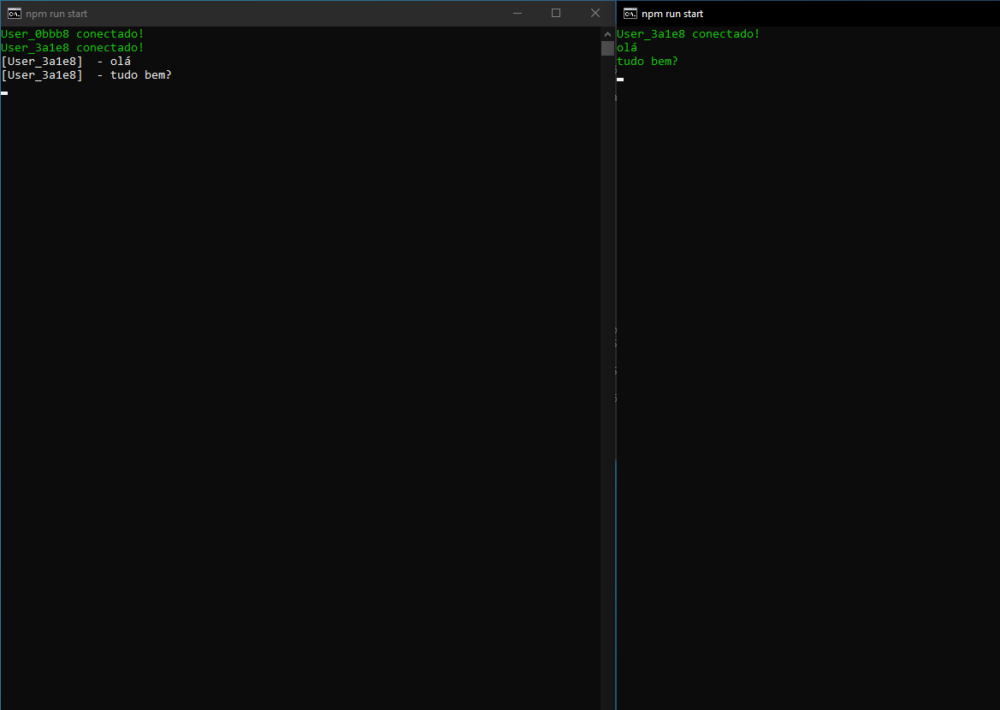
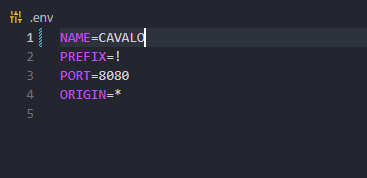
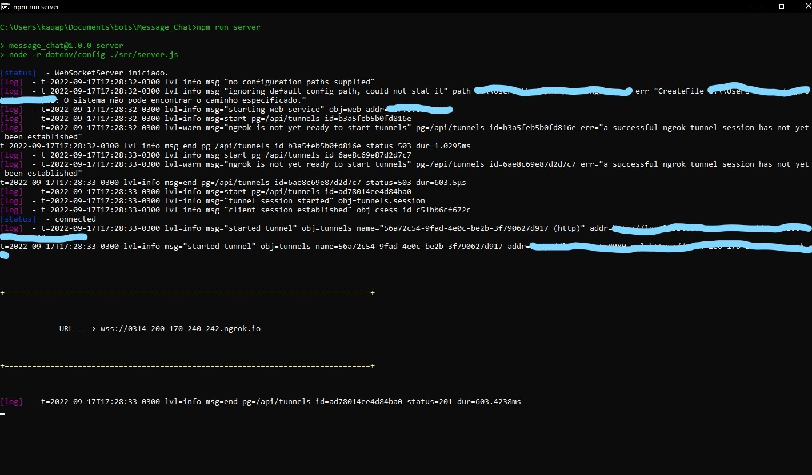
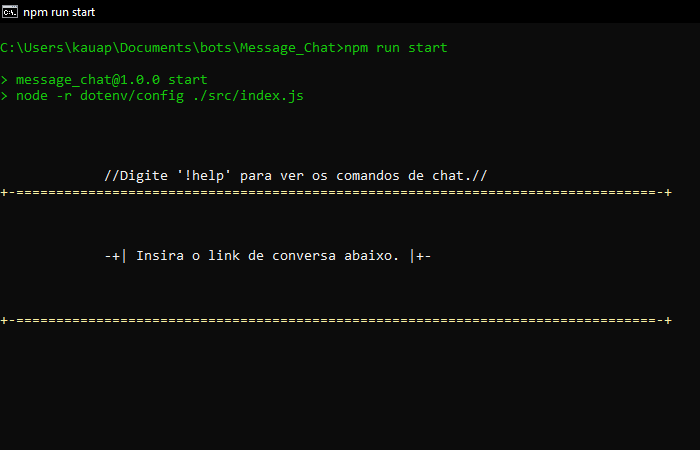
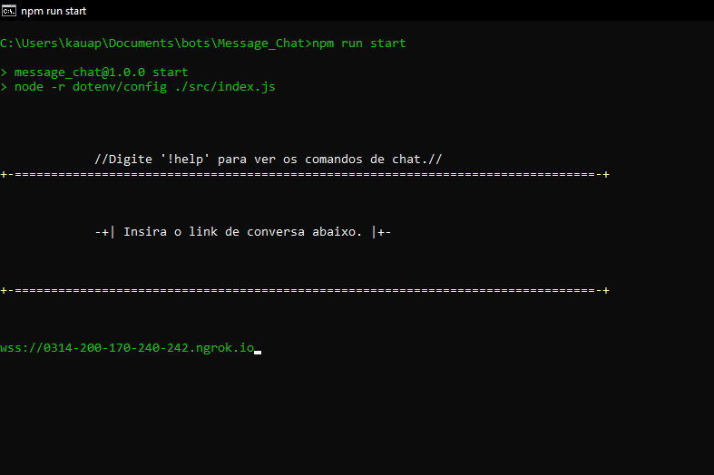
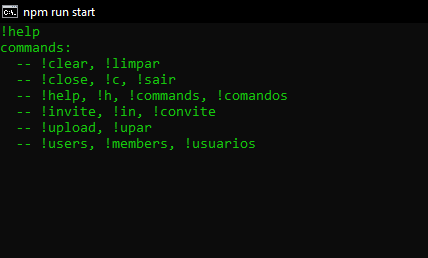

# Message-Chat

O message-chat e um simples chat privado com criptografia, que pode ser usado para conversar com amigos e mandar arquivos...

* Deixe sua ```star``` para mais pessoas verem o projeto.
* Comentem sobre como eu poderia melhorar o projeto.



# Inicio.

* Tenha o ```NodeJs``` na sua maquina, para funcionar o projeto. 

* Digite ```npm install``` no seu terminal da pasta do projeto, e espere o download das packages.

* entre no arquivo ```.env``` e coloque seu nome no campo ```NAME=```.  **EX:** ```NAME=CAVALO```



# Como usar?

Antes de você usar ele para conversar com os amigos por ele, você deve obter um link de acesso cujo qual esta localizado o servidor do chat.
para gerar um, e mais fácil que somar 1+1, más se você já tiver um link, pule essa etapa e vá direto para a parte [Como entrar em um servidor?](https://github.com/KauaAmaroPires/Message_Chat/blob/main/README.md#como-entrar-em-um-servidor).

* Clique 2 vezes sobre o arquivo: ```app_server.bat``` ou digite: ```npm run server``` e copie o link gerado.



**OBS: mantenha a janela aberta...**

# Como entrar em um servidor?

Após copiar o link de convite do server basta seguir os próximos passos:

* Clique 2 vezes sobre o arquivo: ```app.bat``` ou digite: ```npm run start```.
* cole o link e aperte enter.



**OBS: Para que outras pessoas entrem no seu servidor, basta mandar esse link para ela entrar por ele.**

Após isso, você ja vai estar conectado no servidor, as palavras que você mandar, serão entreges as pessoas que estão na mesmo servidor que você e vice-versa.



# Comandos.

message-chat tem suporte para comandos que auxilia em algumas coisas, para usar os comandos, basta digitar o prefixo e em seguida o nome do comando.

**EX: ```!users```**

* O prefixo pode ser alterado nas configurações do arquivo ```.env```, basta trocar o ```PREFIX=!``` por algo tipo ```PREFIX=$!``` 

* Para ver a lista completa de comandos use o comando ```!help```



# Upload e Download de arquivos.

E por fim, o sistema de tranferencia de arquivos, esse sistema pode demorar um pouco para enviar o arquivo dependendo da rede de quem está hospedando, e o tamanho do arquivo.

* coloque o arquivo que deseja enviar na pasta ```app_upload```.
* digite o comando ```!upload```, ele vai mostrar como usar o comando. e bem parecido com isso ```!upload CAVALO photo.png``` referente á ```!upload <user> <arquivo>```
* após enviar o arquivo, ele irá aparecer na pasta ```app_download``` da pessoa que recebeu o arquivo.


**OBS: Caso o arquivo tenha o mesmo nome de algum outro na pasta app_download do destinatário, ele irá reescrever o arquivo com o novo para evitar problemas.**

# 🌟 Finalização

Obrigado por colaborar com o projeto, esse e meu primeiro projeto aqui no GitHub, e minha primeira experiência com websocket.

